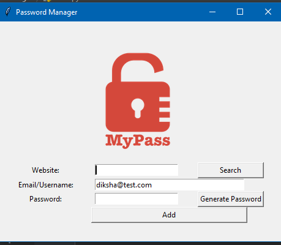
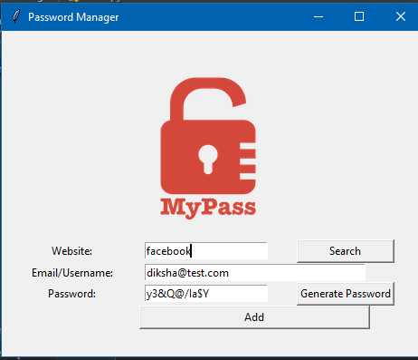
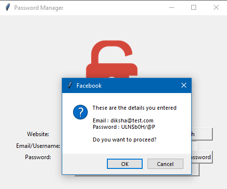
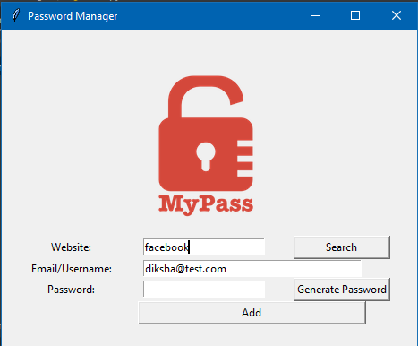
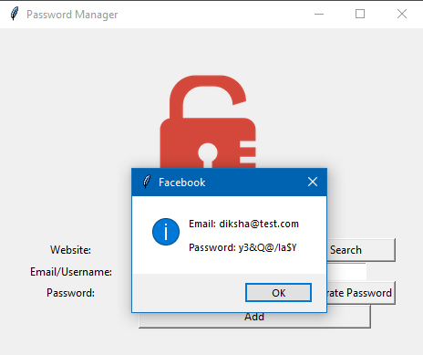

# password-manager

A password managing application using tkinter module.
A user can save the passwords and later retrieve them when required

### User Interface

### Add the details and generate a password.
### Generated password gets copied to the clipboard 

### Click on the add button to save the info

### Enter the website whose details you want to retrieve

### Data retrieved and the password is copied to the clipboard

